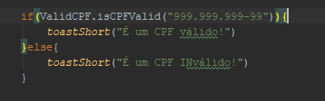

# ValidCpf - Verificar validade do CPF no Android

# Instalação

    allprojects {
      repositories {
        google()
        jcenter()
        ...
        maven { url 'https://jitpack.io' }
      }
    }

Build.gradle

    dependencies {
      implementation 'com.github.fill93:ValidCpf:1.0.0'
    }
    
# Uso

Passe um cpf (com ou sem pontuação) como parâmetro no método

    ValidCPF.isCPFValid("cpf_string")
    
    Este método retorna true caso o CPF seja válido
    
    
# Exemplo

